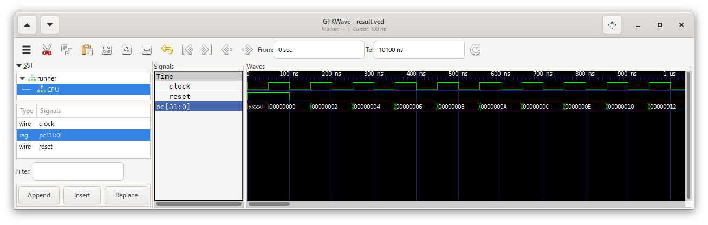

0. 環境構築
===========

シミュレータと波形表示ソフトをインストールし、以下のようなプログラムカウンタだけのCPUを作ります。

## インストール

Windowsの場合、ここからシミュレータと波形表示ソフトがセットになったインストーラをダウンロードできます。

[Icarus Verilog for Windows](http://bleyer.org/icarus/)

その他の場合、この辺を見てなんとかしてください。

* [Icarus Verilog](http://iverilog.icarus.com/)
* [Installation Guide | Icarus Verilog | Fandom](https://iverilog.fandom.com/wiki/Installation_Guide#Windows)
* [GTKWave](http://gtkwave.sourceforge.net/)

## CPUを作る

`cpu.v` にCPUを表すコードを書きました。

クロックの入力端子 `clock` とリセットの入力端子 `reset` を持つモジュール `cpu` を作ります。

```
module cpu(clock, reset);
	input clock;
	input reset;
```

32ビットのプログラムカウンタを用意します。

```
	reg [31:0] pc;
```

クロックの立ち上がりで、リセット入力が1ならプログラムカウンタを0にし、
リセット入力が0ならプログラムカウンタを1命令(2バイト)分進めます。

```
	always @(posedge clock) begin
		if (reset) begin
			pc <= 32'd0;
		end else begin
			pc <= pc + 32'd2;
		end
	end
```

モジュールの終わりを宣言します。

```
endmodule
```

## CPUを動かす部分(テストベンチ)を作る

`runner.v` にCPUを動かすためのコードを書きました。

単位時間を設定します。

```
`timescale 1ns/1ns
```

モジュールの開始を宣言します。

```
module runner();
```

クロックとリセットの信号を用意します。

```
	reg clock;
	reg reset;
```

CPUを用意します。

```
	cpu CPU(.clock(clock), .reset(reset));
```

コードをシミュレーション開始時に実行させます。

```
	initial begin
		...
	end
```

状態をファイル `result.vcd` に出力させます。

```
		$dumpfile("result.vcd");
		$dumpvars(0, runner);
```

クロックとリセットの信号を初期化します。

```
		clock <= 1'b0;
		reset <= 1'b1;
```

100単位時間後、リセットを解除します。

```
		#100
		reset <= 1'b0;
```

さらに10000単位時間後、シミュレーションを終了します。

```
		#10000
		$finish;
```

50単位時間ごとにクロック信号を反転させます。
すなわち、100単位時間周期のクロック信号を生成します。

```
	always #50 begin
		clock <= ~clock;
	end
```

モジュールの終わりを宣言します。

```
endmodule
```

## シミュレーションを行う

`cpu.v` と `runner.v` を入力とし、シミュレーション用のファイル `compiled.out` を生成します。

```
iverilog -o compiled.out cpu.v runner.v
```

シミュレーションを実行します。

```
vvp compiled.out
```

## シミュレーションの結果を確認する

GTKWaveでシミュレーション結果のファイルを開きます。

```
gtkwave result.vcd
```

開いている端末で実行され、そのままだと次のコマンドを実行できなくなります。
Windowsでは`start`コマンドを使うと回避できます。

```
start gtkwave result.vcd
```

SST欄からモジュールを選択し、その下のリストから信号を選択し、Appendを押すと、
右に信号が表示されます。

表示範囲を調整すると、以下のようになり、プログラムカウンタが進んでいく様子が確認できました。


