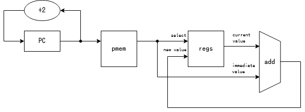
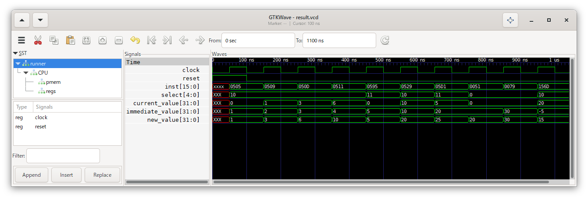

1\. レジスタ+即値
=======

レジスタに即値を加算する `Rd += n6` 命令のみに対応したCPUを作ります。

今回は以下のような構造で実現します。



# やること

* プログラムカウンタ(PC)の値を元にプログラムメモリ(pmem)から命令を読み出す
* 命令をもとに、読み書きするレジスタと加算する即値を決定する
* レジスタの値と即値を加算する
* 加算の結果をレジスタに書き込む

`Rd += n6`命令は、以下の構造をしています。

* 7ビット目～11ビット目に、読み書きするレジスタの番号
* 2ビット目～6ビット目と12ビット目に、加算する即値

残りのビットは本来命令の種類の特定に用いますが、今回は `Rd += n6` 命令のみをサポートするので省略します。

また、レジスタR0の値はゼロに固定する仕様になっています。

# 実行

アセンブリ言語のソースコード `prog_src.txt` を[asm15](https://mikecat.github.io/asm15/)でアセンブルします。  
結果を binary で出力し、`prog.txt` に保存します。  
保存したプログラムを `$readmemb` を用いてメモリに読み込み、実行します。

```
$readmemb("prog.txt", CPU.pmem.mem);
```

以下のような実行結果が得られました。  
(`inst`は16進数で、`select`およびそれぞれの値は10進数で表示しています)



以下のことが確認できます。

* 正の数および負の数の足し算が行えている
* 操作するレジスタの切り替えが反映されている
* レジスタ`R0`への足し算は反映されず、値0を保っている
