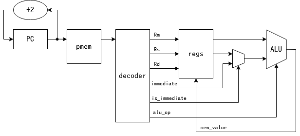
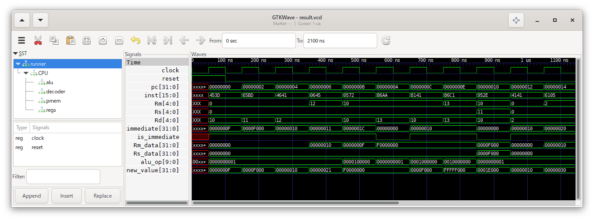
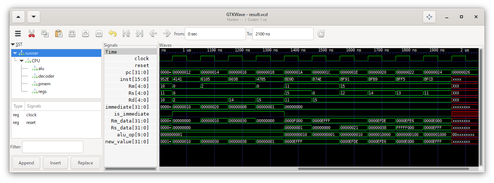

2\. 命令デコーダとALU
=======

加算だけでなく、様々な演算に対応したALUを作ります。  
また、命令を解釈し、ALUの入力を決定する命令デコーダを作ります。

今回は以下のような構造で実現します。



# やること

命令デコーダにより命令を解釈し、

```
Rd = ALU(Rm, Rs)
```

または

```
Rd = ALU(Rm, immediate)
```

という形式の演算に変換します。  
どっちの形式かは、`is_immediate`信号で表します。

レジスタ`R0`の値が0で固定されていることを用いると、  
`Rd = n6` や `Rd = n18` は `Rd = R0 + immediate` と、  
`Rd = Rm` は `Rd = Rm + R0` と表すことができます。

ALUで行う演算の種類を決める`alu_op`は、各ビットを各演算に対応させるワンホットコードとします。

# 実行結果

各命令がきちんと実行できているようです。




