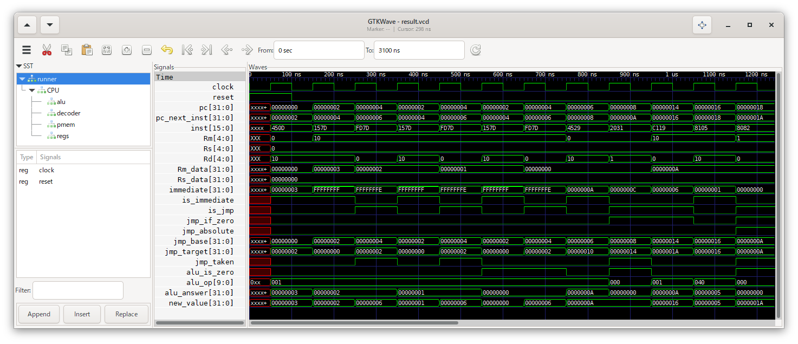

3\. 分岐
=======

分岐命令(条件分岐および無条件分岐)を作成します。

今回は以下のような構造で実現します。

# やること

分岐命令は、プログラムカウンタを次の命令の位置に進めるかわりに、
命令によって指定される位置に動かす命令です。

RV32Cでは、以下の種類の分岐命令があります。

|命令|条件|プログラムカウンタに設定する値|次の命令の位置の保存|
|---|---|---|---|
|c.j|無|プログラムカウンタ + オフセット|無|
|c.jr|無|指定したレジスタの値|無|
|c.jal|無|プログラムカウンタ + オフセット|有|
|c.jalr|無|指定したレジスタの値|有|
|c.beqz / c.bnez|有|プログラムカウンタ + オフセット|無|

「条件付き」で「次の命令の位置を保存する」という命令はありません。  
したがって、以下の制御をできるようにすることで、分岐命令の処理を実現できます。

* 飛び先の基準として「プログラムカウンタ」を使うか「指定したレジスタの値」を使うか
* 指定したレジスタに「ALUの計算結果」を書き込むか「次の命令のアドレス」を書き込むか
* 条件を満たしたらジャンプする(プログラムカウンタを「飛び先の基準 + オフセット」にする)か
* ジャンプする条件は、ALUの計算結果が「0」か「非0」か

次の命令の位置を保存する分岐命令は全て無条件であり、
条件分岐命令は全て次の命令の位置を保存しないので、
「条件を満たしたらジャンプする」場合は常に「指定したレジスタに次の命令のアドレスを書き込む」として良いです。

ALUで行う計算を「なし(常に0を出力する)」とし、「ALUの計算結果が0のときジャンプする」とすることで、
無条件分岐を実行できます。

今はまだサポートしませんが、32bit命令にはプログラムカウンタを「指定したレジスタの値 + オフセット」にする命令もあるので、
オフセットは「プログラムカウンタ」ではなく「飛び先の基準」に足すようにします。

ここでは「指定したレジスタの値 (+ オフセット)」としましたが、
正確には「指定したレジスタの値 (+ オフセット) のLSBを0にした値」が用いられます。  
分岐命令でプログラムカウンタに足したり設定したりする値は常に偶数であり、
プログラムカウンタのLSBは常に0になるので、
「プログラムカウンタ + オフセット」の時も「LSBを0にする」処理を行ってよいでしょう。

命令デコーダに、これまでの「用いるレジスタと即値」「ALUで行う演算」の情報に加え、
「分岐用の情報」を出力する機能を追加します。

なお、c.jr 命令は c.mv 命令の Rm=0 の場合、c.jalr 命令は c.add 命令の Rm=0 の場合の値となっているので、
c.mv 命令や c.add 命令より優先して c.jr 命令や c.jalr 命令かの判定をしないといけません。

# 実行結果

以下のような実行結果が得られ、各命令がうまく実行できているようです。

