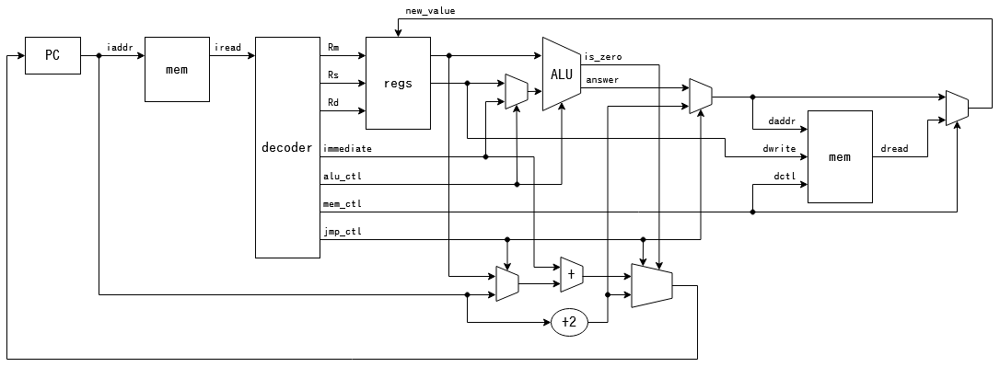
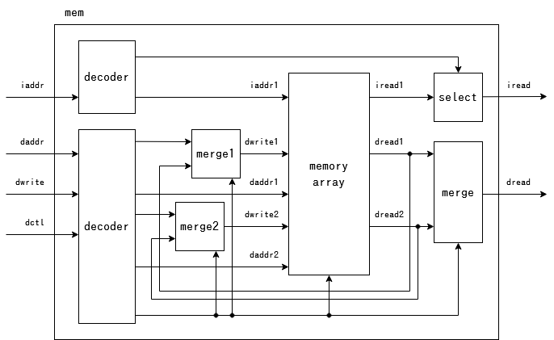
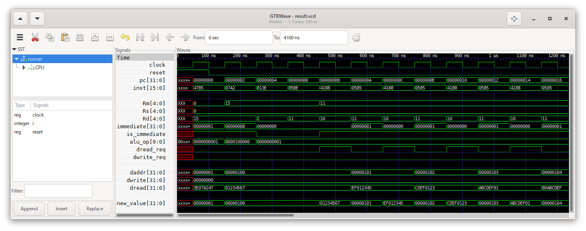
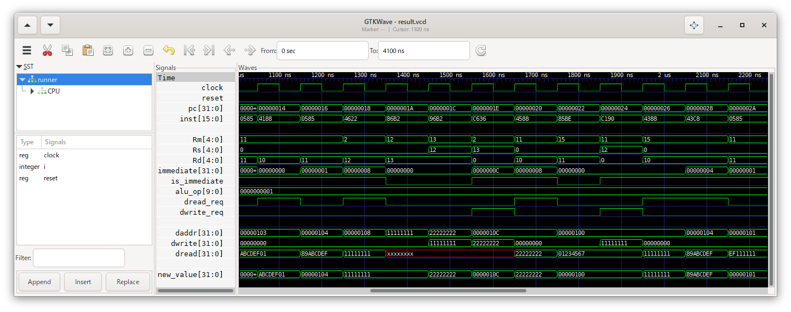
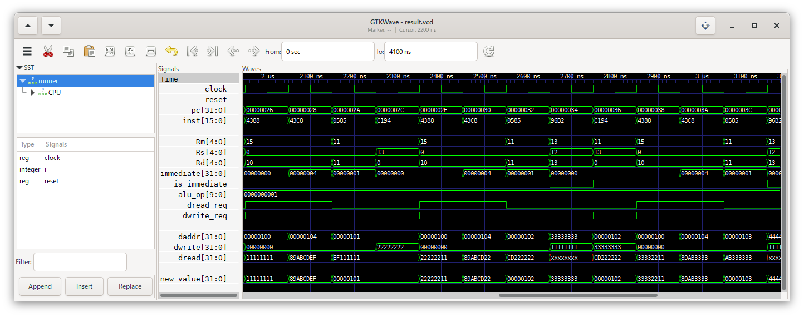

4\. メモリアクセス
==================

メモリへデータを読み書きする命令を作成します。  
命令を読み込むメモリと、データを読み書きするメモリは、同じアドレス空間とします。

今回は以下のような構造で実現します。  
`mem` モジュールは図示の都合で2箇所に分かれていますが、1個のモジュールとします。

# やること

これまで「読み込むアドレスを入力してもらい、それに対応する命令を出力する」
という機能だった `pmem` モジュールを `mem` モジュールとして定義し直し、
「命令の読み込み」と平行で「データの読み書き」を行う機能を追加します。

命令の読み込み機能には、以下の特徴があります。

* 全ての命令の実行に関し、読み込みを行う
* 書き込みは行わない
* 常にちょうど2バイト読み込む (まだ32ビット命令には対応していないので)
* 常に2の倍数のアドレスから読み込む

一方、データの読み書き機能には、以下の特徴があります。

* 命令によって、読み込みを行うかどうかが決まる
* 書き込みを行う場合もある
* 1バイト、2バイト、4バイトの読み書きを行う可能性がある
* 読み込むアドレスは任意の32ビット符号なし整数

これまでは2バイトの読み込みのみなので、1要素が2バイトの配列を使用していました。  
しかし、4バイトの読み書きが入ってくると、これでは読み書きが最大3要素にまたがることになります。  
そこで、1要素を4バイトに変更し、2要素までの読み書きで処理できるようにします。

`mem` モジュールの内部は以下のような構造とします。  
配列の要素の一部を書き換えることができるよう、指定のアドレスの現在のデータを入力に戻し、
書き換えない部分には現在のデータを書き込めるようにします。

さらに、命令のデコーダにメモリアクセス関係の出力を追加します。  
アクセスするアドレスは「レジスタの値 + 即値」という形で表せるので、
ALUの出力をアドレスとして用い、ALUに入力しない方のレジスタの値をメモリに書き込む値とします。

# 実行結果

メモリを読み込んでみる実験。

PUSH/POP(c.swsp/c.lwsp)の実験。

メモリに書き込んでみる実験。

それぞれうまく動いていそうです。
