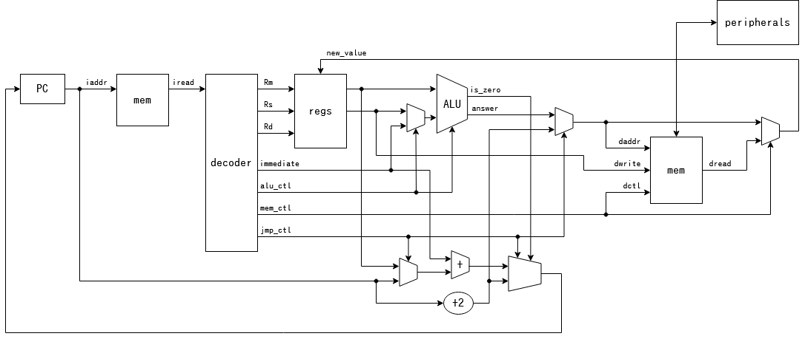
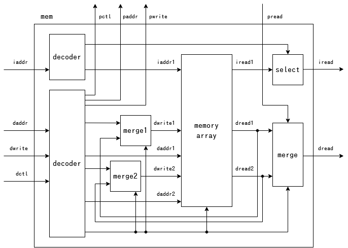
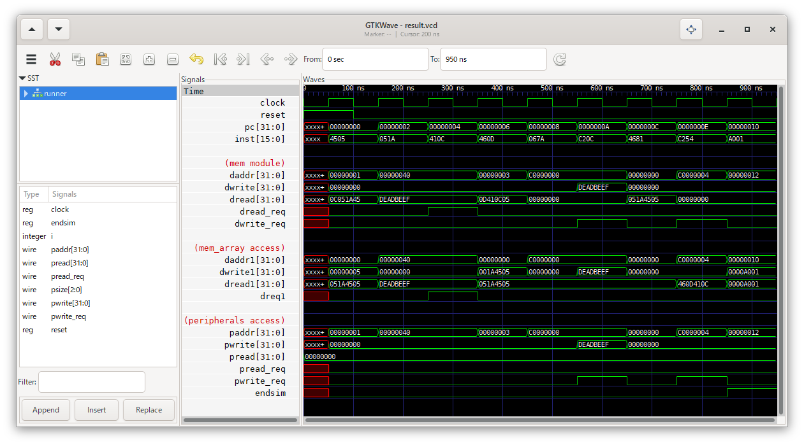
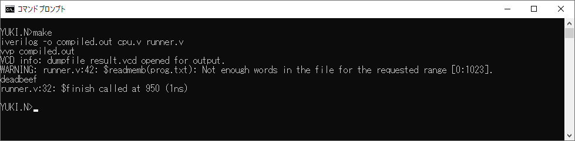

5\. メモリマップドI/O
==================

メモリアクセスモジュールを拡張し、メモリマップドI/Oを実現します。  
ここでは、 `0x00000000` ～ `0xbfffffff` をメモリ用の領域、
`0xc0000000` ～ `0xffffffff` をI/O用の領域とします。

今回は以下のような構造で実現します。

# やること

メモリマップドI/Oへのアクセスはメモリアクセスとして行うので、 `mem` モジュールを拡張します。  
すなわち、 `mem` モジュールにアクセス先のペリフェラルを接続します。

`mem` モジュールの内部は以下のようになります。  
命令のフェッチを介してメモリマップドI/Oにアクセスするのは意味が薄いと考え、
データの読み書きからのみメモリマップドI/Oにアクセスできる仕様とします。  
さらに、1回のメモリアクセスで一気に複数のメモリマップドI/Oにアクセスする意味も薄いと考え、
1回の命令でのメモリマップドI/Oへのアクセスは1回のみとします。

ペリフェラルにアクセスする信号はCPUのモジュールの外側に引き出し、
ペリフェラルをCPUと独立して定義できるようにします。  
今回は、テスト用として、以下のペリフェラルを定義します。

* `0xc0000000` : 書き込まれた値を `$display` で出力する
* `0xc0000004` : 書き込みアクセスの1クロック後にシミュレーションを終了する

これを用いることで、手動で波形を見てチェックを行うだけでなく、
入力と出力の対応関係による自動でのテストがしやすくなることが期待できます。

# 実行結果

メモリにアクセスする時はペリフェラルへのアクセスは行わず、
ペリフェラルにアクセスする時はメモリへのアクセスは行っていないことがわかります。

`0xc0000000` に書き込んだ値 `deadbeef` が出力されていることがわかります。

