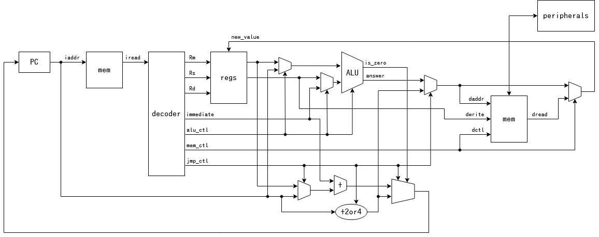
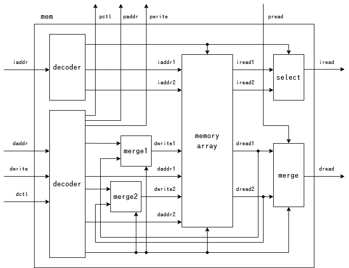
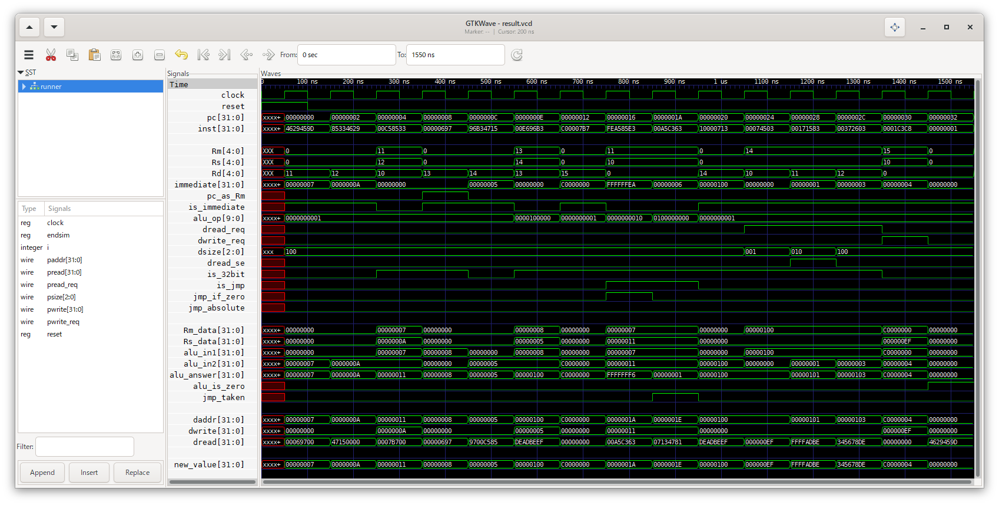

6\. 32ビット命令
================

32ビットの代入・演算・メモリアクセス・比較・分岐命令に対応させます。

今回は以下のような構造で実現します。

# やること

32ビットの命令を実行できるようにするため、まず命令をフェッチする部分を変更し、32ビットをフェッチできるようにします。  
このため、命令についても1回に2単位(1単位は4バイト)の読み出しが必要になることがあります。  
そこで、2本目の命令読み出し(iaddr2/iread2)を追加します。  
読み出すアドレスが4の倍数であれば2本目の読み出しは要らないので、制御信号も追加します。  
この変更を加えたメモリモジュールは、以下のようになります。

さらに、命令デコーダを変更し、32ビット命令を認識できるようにします。  
次の命令が今の命令の2バイト先とは限らなくなるので、命令のサイズに合わせてPCに足す量を調整します。  
また、auipc命令用に、PCの値をALUの入力にできるようにします。

ALUやデータメモリへのアクセスは、既に32ビット命令を意識した仕様にしていたので、変更せずにすみます。  
(比較命令や4バイト以外のメモリアクセスは16ビット命令では出てこないが、用意していました)

# 実行結果

32ビットの計算命令や分岐命令、メモリアクセス命令が実行できています。

